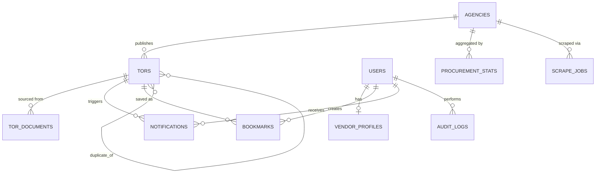

# City Of Software — MongoDB Atlas Database Design

Based on the Project Proposal (Discovery & Notification Platform for BMA Software Procurement). Stack: Next.js frontend, Node.js backend, MongoDB Atlas, Vertex AI for extraction.

> **Naming note:** fields below are written in `snake_case` for readability. The actual Mongoose models in `back-end/src/models/*.ts` use `camelCase` (e.g. `agencyId`, `submissionDeadline`) to match the existing TypeScript backend scaffold already in this repo — see [Implementation](#implementation) below.

> **Note on `tor_documents`:** the backend scaffold already had a generic `Document` model (`back-end/src/models/Document.ts`) for uploaded files + OCR text + AI summary. Rather than duplicate it, this design reuses it and adds `torId` / `agencyId` / `uploadedBy` links — see that section below.

## Design principles

- **Reference, don't nest, high-growth or independently-queried entities.** TORs, agencies, vendors, and notifications are each queried, filtered, and paginated on their own, so they're top-level collections linked by `ObjectId` refs rather than nested documents.
- **Embed small, bounded, always-read-together data.** A vendor's certifications or a TOR's evaluation criteria are small arrays that are always fetched with their parent, so they're embedded subdocuments instead of separate collections.
- **Denormalize display fields onto hot paths.** `tors` stores `agency_name` alongside `agency_id` so list/search views don't need a `$lookup` per row. Kept in sync on agency update (rare) via a small backend job.
- **Materialize analytics.** The historical pricing dashboard reads from a precomputed `procurement_stats` collection refreshed by a scheduled aggregation, instead of running expensive aggregations on every dashboard load.

## Collection overview (ERD)



## Collections

### `agencies`

One document per BMA agency/department that publishes TORs.

```jsonc
{
  _id: ObjectId,
  name: "สำนักงานเขตบางรัก",
  name_en: "Bang Rak District Office",
  code: "BMA-BR",                       // short internal code
  agency_type: "district_office",       // district_office | department | public_enterprise | other
  website_url: "https://www.bangkok.go.th/bangrak",
  tor_sources: [                        // where the scraper looks
    {
      url: "https://www.bangkok.go.th/bangrak/procurement",
      method: "scrape",                 // scrape | manual
      last_scraped_at: ISODate,
      last_status: "ok"                 // ok | error | changed_format
    }
  ],
  contact: { address: String, phone: String, email: String },
  is_active: true,
  created_at: ISODate,
  updated_at: ISODate
}
```

Indexes: `{ code: 1 }` unique, `{ name_en: "text", name: "text" }`.

### `tors` (core entity)

One document per procurement notice (TOR).

```jsonc
{
  _id: ObjectId,
  agency_id: ObjectId,        // ref agencies
  agency_name: "Bang Rak District Office",   // denormalized for list views

  title: String, title_en: String,
  // The SRS's approved TOR lifecycle (Section 9.3), adopted wholesale in
  // place of an earlier, narrower enum — see "Extraction pipeline v2" below.
  status: "discovered" | "extracting" | "pending_review" | "published" | "rejected" | "superseded" | "closed" | "archived",
  reference_number: String,   // as printed in the source; not unique across agencies
  description: String,        // extracted description — distinct from summary_ai.text (the generated summary)
  procurement_method: "e_bidding" | "selection" | "special_method" | "specific_method" | "other",
  project_type: "web_application" | "mobile_application" | "it_system" | "other",
  technologies: [String],     // e.g. ["React", "Node.js", "PostgreSQL"] — extracted tags, multikey-indexed
  key_risks: [String],
  estimated_complexity: "low" | "medium" | "high",

  budget: {
    amount_thb: Number,
    is_estimated: Boolean,
    vat_basis: "inclusive" | "exclusive" | "unstated"
  },

  timeline: {
    announcement_date: ISODate,
    comment_period_start: ISODate,   // public-comment window start, if applicable
    comment_period_end: ISODate,     // public-comment deadline, if applicable
    clarification_meeting_date: ISODate,
    submission_deadline: ISODate,
    project_duration_days: Number,
    contract_start_date: ISODate,
    contract_end_date: ISODate
  },

  qualifications: {
    min_contract_value_thb: Number,   // e.g. 1,500,000 threshold from the proposal
    required_certifications: [String],
    required_experience_years: Number,
    raw_text: String                  // original extracted qualification text
  },

  evaluation_criteria: [
    { criterion: String, weight_percent: Number }
  ],
  deliverables: [String],

  summary_ai: {
    text: String,
    model: String,           // e.g. "vertex-gemini-flash"
    generated_at: ISODate,
    confidence: Number       // 0-1
  },

  // AI-extraction outputs (distinct from lifecycle/source_ref, which are
  // scrape-derived, and from review, which is the human decision).
  extraction: {
    overall_confidence: Number,          // [0,1] — drives review routing (FR-EXT-05)
    field_confidence: Map<String, Number>, // per FIELD, flat keys, e.g. "budget" -> 0.42
    model_version: String,
    prompt_version: String,
    ocr_used: Boolean,
    language: "th" | "en" | "mixed",
    discarded_fields: [String],          // dropped for lacking grounding in the source (FR-EXT-09)
    human_corrected_fields: [String],    // never overwritten by re-extraction (NFR-DAT-06)
    last_processed_at: ISODate,
    last_document_id: ObjectId
  },

  // Budget-outlier flag (FR-ANL-04–07). Tri-state, same convention as
  // lifecycle.is_awarded below: null = not evaluated / insufficient data,
  // a different fact from "confirmed not an outlier."
  outlier: {
    is_outlier: Boolean,   // true | false | null
    reason: "no_budget" | "no_project_type" | "no_year" | "insufficient_comparables" | "within_range" | "outlier",
    basis_agency_id: ObjectId,
    basis_project_type: String,
    basis_year: Number,
    comparable_count: Number,
    deviation_pct: Number,
    evaluated_at: ISODate
  },

  source: {
    source_url: String,
    import_method: "scrape" | "manual",
    discovered_at: ISODate
  },
  document_ids: [ObjectId],  // ref documents (see Document.ts)

  review: {
    extraction_status: "pending" | "approved" | "rejected",
    reviewed_by: ObjectId,   // ref users (admin)
    reviewed_at: ISODate,
    notes: String
  },

  // 'none' | 'suspected' (linked via merge_candidate_ids, awaiting admin
  // resolution) | 'confirmed' (resolved to duplicate_of, this record superseded).
  duplicate_status: "none" | "suspected" | "confirmed",
  duplicate_of: ObjectId,          // ref tors — the record this one was superseded by
  merge_candidate_ids: [            // scored duplicate candidates (FR-EXT-08) — never auto-merged
    {
      tor_id: ObjectId, score: Number, title_similarity: Number,
      same_agency: Boolean, same_reference_number: Boolean,
      budget_proximity: Number, date_proximity_days: Number, detected_at: ISODate
    }
  ],

  stats: { view_count: Number, bookmark_count: Number },

  created_at: ISODate,
  updated_at: ISODate
}
```

Indexes:
- `{ title: "text", title_en: "text", "summary_ai.text": "text" }` — full-text search
- `{ status: 1, "timeline.submission_deadline": 1 }` — active listings sorted by deadline
- `{ agency_id: 1, status: 1 }`
- `{ project_type: 1, technologies: 1 }` (multikey)
- `{ "budget.amount_thb": 1 }`
- `{ "timeline.submission_deadline": 1 }` — deadline calendar
- `{ "review.extraction_status": 1 }` — admin review queue
- `{ "sourceRef.identityKey": 1 }` unique sparse — the scrape pipeline's upsert key
- `{ "lifecycle.stage": 1, "lifecycle.isAwarded": 1 }` — pre-award discovery
- `{ reference_number: 1, agency_id: 1 }` sparse — reference numbers aren't unique across agencies
- `{ "timeline.announcement_date": 1, agency_id: 1 }` — duplicate pre-filter and outlier year-bucketing
- `{ "outlier.is_outlier": 1 }` — analytics dashboard's outlier list
- `{ status: 1, created_at: 1 }` — FR-ADM-01's review queue, oldest-first
- `{ duplicate_status: 1 }`

### `documents` (formerly planned as `tor_documents`)

Raw source files (PDF/scanned image) and their OCR text, kept separate from `tors` so large OCR text doesn't bloat the hot document. This maps onto the `Document` model already present in the backend scaffold (`originalName`, `mimeType`, `size`, `status`, `extractedText`, `summary`, `metadata.{pageCount,confidence}`), extended with three link fields:

```jsonc
{
  _id: ObjectId,
  originalName: String, mimeType: String, size: Number,
  status: "uploaded" | "extracted" | "summarized" | "error",
  extractedText: String,
  summary: String,
  metadata: { pageCount: Number, confidence: Number },

  // added for City Of Software:
  torId: ObjectId,      // ref Tor, null until linked during admin review
  agencyId: ObjectId,   // ref Agency
  uploadedBy: ObjectId, // ref User, null if from the scraper

  origin: {              // provenance for pipeline-fetched files; null on user uploads
    sourceUrl: String, label: String, storageKey: String, sha256: String,
    downloadedAt: ISODate, insecureTransport: Boolean
  },
  extraction: {           // AI-extraction retry bookkeeping (NFR-REL-03)
    attempts: Number, lastAttemptAt: ISODate, lastError: String
  },

  createdAt: ISODate, updatedAt: ISODate
}
```

Indexes: `{ torId: 1 }`, `{ "origin.sha256": 1 }` sparse, `{ "origin.storageKey": 1 }` sparse, `{ status: 1, createdAt: 1 }` (the AI-extraction sweep's work queue).

### `extraction_jobs`

One attempt to turn one source `document` into structured `tor` fields. Deliberately separate from `scrape_jobs` (which tracks a whole per-agency crawl run, not a single document's extraction) — a `document` can have more than one `extraction_job` (a retry, or a future re-extraction after a correction), and each carries the model/prompt version, per-field confidence, and cost that a published record needs to stay traceable (NFR-MNT-05, FR-EXT-10).

```jsonc
{
  _id: ObjectId,
  documentId: ObjectId, torId: ObjectId,
  status: "running" | "success" | "partial" | "failed",
  startedAt: ISODate, finishedAt: ISODate,
  modelVersion: String, promptVersion: String,
  ocrUsed: Boolean, language: "th" | "en" | "mixed",
  overallConfidence: Number,
  fieldConfidence: Map<String, Number>,
  discardedFields: [{ field: String, reason: String }],
  processingTimeMs: Number, estimatedCostThb: Number,
  routedTo: "pending_review" | "published",
  errors: [String],
  createdAt: ISODate, updatedAt: ISODate
}
```

Indexes: `{ documentId: 1, startedAt: -1 }`, `{ torId: 1, startedAt: -1 }`, `{ status: 1, startedAt: -1 }`.

### `users`

Shared auth collection for vendors, admins, and public accounts. Role-specific data lives in `vendor_profiles`.

```jsonc
{
  _id: ObjectId,
  email: String,             // unique
  password_hash: String,
  role: "vendor" | "admin" | "public",
  name: String,
  phone: String,
  email_verified: Boolean,
  status: "active" | "suspended",
  created_at: ISODate,
  last_login_at: ISODate
}
```

Indexes: `{ email: 1 }` unique, `{ role: 1 }`.

### `vendor_profiles`

One-to-one with a `users` document where `role: "vendor"`.

```jsonc
{
  _id: ObjectId,
  user_id: ObjectId,          // ref users, unique
  company_name: String, company_name_en: String,
  registration_number: String,
  company_size: "freelancer" | "small" | "medium" | "large",
  founded_year: Number,

  tech_stack: [String],
  certifications: [
    { name: String, issuer: String, obtained_date: ISODate, expiry_date: ISODate }
  ],
  past_contracts: [
    { agency_name: String, project_title: String, contract_value_thb: Number, year: Number, evidence_url: String }
  ],
  total_contract_value_thb: Number,   // derived, recomputed on write

  interests: {
    project_types: [String],
    technologies: [String],
    budget_range: { min_thb: Number, max_thb: Number },
    agency_ids: [ObjectId]
  },
  notification_prefs: {
    channels: [String],               // ["email", "in_app"]
    frequency: "instant" | "daily_digest",
    min_match_score: Number
  },

  created_at: ISODate,
  updated_at: ISODate
}
```

Indexes: `{ user_id: 1 }` unique, `{ tech_stack: 1 }`, `{ "interests.technologies": 1 }`.

### `bookmarks`

```jsonc
{ _id: ObjectId, user_id: ObjectId, tor_id: ObjectId, created_at: ISODate }
```

Index: `{ user_id: 1, tor_id: 1 }` unique compound.

### `comparisons` (saved comparison sets — optional, supports "share this comparison")

```jsonc
{ _id: ObjectId, user_id: ObjectId, name: String, tor_ids: [ObjectId], created_at: ISODate }
```

### `notifications`

```jsonc
{
  _id: ObjectId,
  user_id: ObjectId,
  tor_id: ObjectId,
  type: "new_match" | "deadline_reminder" | "status_change",
  match_score: Number,        // qualification-matching score, if type = new_match
  channel: "email" | "in_app",
  status: "queued" | "sent" | "failed" | "read",
  sent_at: ISODate,
  read_at: ISODate,
  created_at: ISODate
}
```

Indexes: `{ user_id: 1, status: 1, created_at: -1 }`, `{ tor_id: 1 }`.

### `audit_logs`

Admin tooling: import, edit-metadata, approve/reject extraction, merge duplicates.

```jsonc
{
  _id: ObjectId,
  actor_id: ObjectId,        // ref users (admin)
  action: "tor.import" | "tor.edit" | "tor.approve" | "tor.reject" | "tor.merge" | "vendor.suspend" | "...",
  entity_type: "tor" | "vendor" | "agency" | "user",
  entity_id: ObjectId,
  before: Object,            // prior field values (partial)
  after: Object,             // new field values (partial)
  ip_address: String,
  created_at: ISODate
}
```

Index: `{ entity_type: 1, entity_id: 1, created_at: -1 }`, `{ actor_id: 1, created_at: -1 }`.

### `procurement_stats` (materialized analytics)

Refreshed by a scheduled aggregation job (e.g. nightly) over `tors`; the dashboard reads this directly instead of aggregating on demand.

```jsonc
{
  _id: ObjectId,
  agency_id: ObjectId,
  project_type: String,
  year: Number,
  count: Number,
  avg_budget_thb: Number,
  median_budget_thb: Number,
  min_budget_thb: Number,
  max_budget_thb: Number,
  outlier_tor_ids: [ObjectId],   // budgets flagged > N std dev from mean
  updated_at: ISODate
}
```

Index: `{ agency_id: 1, project_type: 1, year: 1 }` unique compound.

### `scrape_jobs`

Tracks each scraper/ingestion run for pipeline monitoring.

```jsonc
{
  _id: ObjectId,
  agency_id: ObjectId,
  started_at: ISODate,
  finished_at: ISODate,
  status: "running" | "success" | "partial" | "failed",
  tors_found: Number,
  tors_new: Number,
  errors: [String]
}
```

Index: `{ agency_id: 1, started_at: -1 }`.

## Mapping proposal features → collections

| Feature | Collections used |
|---|---|
| Automated discovery / manual bulk import | `scrape_jobs`, `documents`, `tors.source` |
| AI extraction & summarization | `documents.extractedText`/`summary`, `tors.summary_ai`, `tors.review` |
| Centralized search & filtering | `tors` (text index + compound filters) |
| Vendor profiles & qualification matching | `vendor_profiles`, `tors.qualifications` |
| Notifications | `notifications`, `vendor_profiles.notification_prefs` |
| Historical procurement analytics | `procurement_stats` |
| Comparison, bookmarking, deadline calendar | `comparisons`, `bookmarks`, `tors.timeline` |
| Admin tooling (import, edit, dedup) | `audit_logs`, `tors.duplicate_of` / `merge_candidate_ids` |

## Implementation

Mongoose models matching this design live in `back-end/src/models/`:

- `Agency.ts`, `Tor.ts`, `User.ts`, `VendorProfile.ts`, `Bookmark.ts`, `Comparison.ts`, `Notification.ts`, `AuditLog.ts`, `ProcurementStat.ts`, `ScrapeJob.ts`, `ExtractionJob.ts` — new
- `Document.ts` — existing model, extended with `torId` / `agencyId` / `uploadedBy` / `origin` / `extraction`

The extraction pipeline that populates `tors`, `documents`, `scrape_jobs`, and `extraction_jobs` is documented separately in [extraction-pipeline.md](extraction-pipeline.md), which now also covers the review workflow, AI-extraction wiring, scheduling, cross-record duplicate detection, and budget-outlier analytics — see its "Review, OCR, scheduling, duplicates & outliers" section.

Wired up as of that work: `GET/POST /api/review/*` (the approval queue, plus `POST /api/review/tors` for admin-created manual TORs — US-041, Section 13.11), `GET /api/tors*` (the first Tor-facing read API), `GET /api/extraction/ai-jobs*`, a cron-driven scheduler (off by default), cross-record duplicate scoring, and the `procurement_stats` outlier aggregation (triggered manually or on schedule, not yet automatically nightly-only).

Still not wired up: the qualification-matching scoring logic, the notification dispatch job, any authentication/RBAC (every new admin-facing route has a `// TODO: auth middleware` marker and trusts a client-supplied `actorId`), and the full repository search/filter/sort API (FR-REP-*) — the `GET /api/tors` endpoint is intentionally minimal (published records only, no filters).

## Atlas-specific notes

- Use **Atlas Search** (Lucene-based) instead of plain MongoDB text indexes for `tors` if fuzzy/multi-language (Thai + English) search quality matters — plain `$text` indexes don't handle Thai tokenization well.
- Store PDFs/images in object storage (GCS, since Vertex AI is already GCP), not in MongoDB — `tor_documents.file_url` just points to it. Avoids GridFS overhead for a budget-conscious Flex-tier cluster.
- Given the THB 800/month **Atlas Flex tier** budgeted in the proposal, keep working-set size small: don't store OCR raw text or AI prompt/response payloads on the hot `tors` document (see `tor_documents` split above).
- Add a **TTL index** on `notifications` (e.g. 180 days) if in-app notification history doesn't need to be kept indefinitely, to control storage growth.
