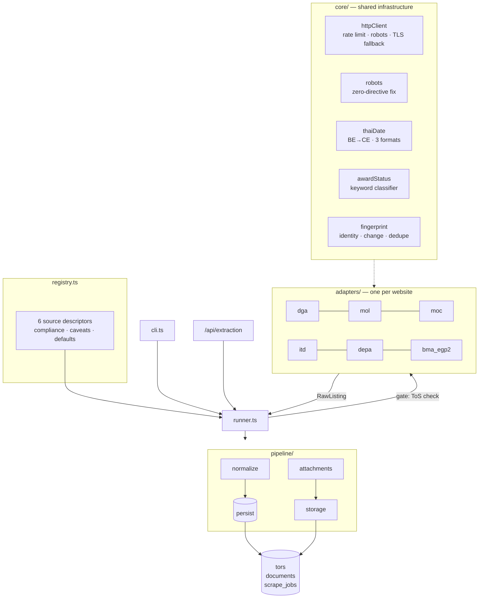

# Core Infrastructure & Extraction Pipeline

How pre-award Thai government procurement data gets from six public websites into `tors`, `documents`, and `scrape_jobs` — and, as of Section 13, what happens to it after that: AI extraction, confidence-gated review, cross-record duplicate detection, budget-outlier flags, and scheduled crawling.

**Sources:** 6 · **Runtime:** Node 18+ / TypeScript · **Location:** `back-end/src/extraction/`, `back-end/src/scheduler/`, `back-end/src/analytics/` · **Companion doc:** [database-design.md](database-design.md)

This is a TypeScript port of the Python research scrapers documented in `PRE_AWARD_PLAYBOOK.md`. The port is deliberate about carrying over the playbook's hard-won behaviours rather than re-deriving them from each site's current markup — those behaviours are called out below wherever they shaped a design decision.

---

## 1 · What this pipeline is for

Awarded-contract data is easy to get: the national e-GP API publishes it, and every one of 26,814 BMA rows pulled from it had a signed contract. That data is useless to a vendor looking for work.

**Pre-award data — draft TOR, open bidding, live public-comment windows — is the entire point.** It exists only on individual agency websites, in inconsistent formats, and most of it is only actionable for a few days. Everything below follows from that.

---

## 2 · Architecture



### The seam

`RawListing` (in [`types.ts`](../back-end/src/extraction/types.ts)) is the only contract that matters.

- **Adapters know one website each.** They produce `RawListing` and never touch Mongoose.
- **Everything downstream knows nothing about websites.** The normalizer, dedupe, and persistence layers treat all six sources identically.

Adding a seventh source is one adapter file plus one registry entry. Nothing else changes.

---

## 3 · Module layout

| Path | Responsibility |
|---|---|
| `types.ts` | `RawListing`, `SourceAdapter`, `SourceDescriptor`, `RunResult` — the contracts |
| `registry.ts` | The six sources: compliance posture, caveats, defaults |
| `core/httpClient.ts` | Polite HTTP: honest UA, per-host rate limit, retries, charset decode, TLS fallback |
| `core/robots.ts` | robots.txt fetch/parse/cache, with the zero-directive fix |
| `core/thaiDate.ts` | Buddhist Era conversion, three date formats, comment windows, currency |
| `core/awardStatus.ts` | Thai keyword classifier — priority-ordered, ported verbatim |
| `core/fingerprint.ts` | Identity key, content hash, boilerplate stripping, republication grouping |
| `core/html.ts` | cheerio helpers, PDF link extraction, labelled-field reads |
| `core/logger.ts` | Scoped logger whose `collected` feeds `ScrapeJob.errors` |
| `core/config.ts` | Extraction settings, readable without a database connection |
| `adapters/*.adapter.ts` | One per website |
| `pipeline/runner.ts` | Orchestration, compliance gate, job lifecycle |
| `pipeline/normalize.ts` | `RawListing` → Tor upsert |
| `pipeline/attachments.ts` | Download PDFs, create Documents |
| `pipeline/storage.ts` | Content-addressed blob store (local now, GCS later) |
| `core/fieldSchema.ts` | The 16-field extraction vocabulary, `FIELD_TO_TOR_PATH`, `EXTRACTION_PROMPT_VERSION` |
| `core/grounding.ts` | FR-EXT-09 grounding check — is a claimed value backed by real source text |
| `core/duplicateDetection.ts` | Cross-corpus similarity scoring (title trigrams, budget/date proximity) |
| `core/reviewRouting.ts` | The BR-03/TBD-01 confidence-gated publish decision |
| `pipeline/duplicateCheck.ts` | Wires duplicate scoring into `runner.ts`'s persist loop |
| `pipeline/aiExtraction.ts` | The AI extraction sweep — OCR, structured fields, review routing |
| `../analytics/outlierMath.ts`, `procurementStats.ts` | IQR-based outlier math and the `ProcurementStat` aggregation |
| `../scheduler/` | `cronConfig.ts`, `lock.ts`, `index.ts` — cron wiring and overlap protection |
| `cli.ts` | `npm run extract` (`--source`/`--all`, plus `--extract-ai`/`--analyze-outliers`) |

See [Section 13](#13--review-ocr-scheduling-duplicates--outliers) for how these fit together.

---

## 4 · Core infrastructure

### 4.1 The three-value award state

The single most important type decision in the pipeline:

```ts
isAwarded: boolean | null   // never a plain boolean
```

`null` means **the source did not say**, which is a different fact from "confirmed not awarded". About 65% of DEPA's 855 announcements use `วิธีเฉพาะเจาะจง` (direct appointment) — a procurement method that legally skips the public TOR and bidding stages, so the title never states one, and no status field exists on the listing or the detail page. Collapsing `null` into `false` would present 549 unclassifiable rows as actionable tenders.

This propagates all the way through: `Tor.lifecycle.isAwarded` defaults to `null`, and `--pre-award-only` filters on `isAwarded === false`, not on "not true".

### 4.2 Classification signal strength

Not all stage verdicts are worth the same, so every TOR records how its stage was determined:

| `signal` | Meaning | Sources |
|---|---|---|
| `authoritative` | The site's own status code | eGP BMA2 only |
| `doc_type` | A labelled document-type field | ITD, DGA |
| `title_keyword` | Keyword match on the title | everywhere else |

A consumer can then weight a `title_keyword` guess differently from a fact. This is playbook step 8 encoded as a stored field rather than left as tribal knowledge.

### 4.3 Classifier priority order is load-bearing

`core/awardStatus.ts` checks rules in a fixed order, and three of those orderings exist to fix specific observed collisions:

- `cancelled` first — `ยกเลิกประกาศประกวดราคา` would otherwise match `bidding_open`.
- `awarded` before anything mentioning `ประกวดราคา` — winner announcements name the bidding method in passing.
- `price_reference` **before** `bidding_open` — price-disclosure titles nearly always carry `ด้วยวิธีประกวดราคาอิเล็กทรอนิกส์` as a modifier. Found on ITD.

`awarded` also matches on the full phrase `สาระสำคัญในสัญญา`, never bare `สัญญา`, so `ร่างสัญญา` (draft contract) is not mistaken for an award.

> **Verified:** the ported rule table is identical to `award_status.py` stage-for-stage and keyword-for-keyword, and replaying the ported algorithm over all 991 real titles in the recorded scraper outputs reproduces the recorded `stage` column exactly — 0 mismatches, including ITD's doc-type-plus-title path.

### 4.4 Dates: three formats, one parser

Every source publishes in Buddhist Era, 543 years ahead of CE. Three formats appear:

| Format | Example | Sources |
|---|---|---|
| Thai month, 4-digit BE | `18 สิงหาคม 2569` | MOL, ITD, MOC |
| Thai abbreviated, 4-digit CE | `14 ส.ค. 2026` | DEPA |
| **English abbreviated, 2-digit BE** | `27 Jul 69` | **DGA — every row** |

The third is easy to miss and was: a Thai-only parser returns `null` for DGA's entire output, and a source with no parseable dates cannot be freshness-checked at all — the one check the playbook says to run every time. Two-digit years are read as short BE (`69` → 2569 → 2026), and every result is range-checked against a plausible window so an absurd date is rejected rather than stored.

> **Verified:** all 927 real date strings across the recorded outputs parse, with correct BE→CE conversion.

### 4.5 robots.txt, parsed here rather than borrowed

Python's `urllib.robotparser` returns `can_fetch() === false` for a robots.txt with zero `User-agent` groups — backwards, since a file with no rules restricts nothing. depa.or.th serves exactly that (a "content signals" style file with no traditional directives).

`core/robots.ts` implements the rules directly so that case is explicit:

- No reachable robots.txt → allowed
- Reachable, zero groups → **allowed** (the bug above)
- Groups present → longest-matching rule wins, `Allow` beats `Disallow` on a tie
- A group naming our UA beats the wildcard group
- `Crawl-delay` is honoured when longer than our own floor

> **Verified:** 11 cases pass, including the DEPA zero-directive file, BMA's `/upload/` disallow, `Allow`-beats-`Disallow`, and end-anchored wildcards.

### 4.6 Politeness, and why downloads are checked too

`core/httpClient.ts` enforces four things:

1. **Honest User-Agent** naming the project with a contact route. No browser impersonation.
2. **Per-host serialised requests** with a ≥1s gap, raised if robots.txt asks for more. Hosts are independent of one another.
3. **robots.txt checked on downloads, not just page fetches.** BMA's old CMS allows crawling its listing pages while disallowing the `/upload/` path its PDFs live under. A pipeline that checks only page fetches downloads files the site asked it not to — that was missed on a first pass in the research project and the PDFs had to be deleted afterwards.
4. **Broken TLS chains retry rather than crash.** Several `.go.th` hosts (confirmed: dft.go.th) serve incomplete certificate chains. Since this is public data behind no login, the fallback re-requests with verification disabled *for that one request* via `node:https` — never by setting `NODE_TLS_REJECT_UNAUTHORIZED` — and flags `insecure: true` so it lands on the job record instead of passing silently.

Responses are decoded using the charset the server declares; several Thai CMSes still serve `windows-874`/TIS-620, and reading those as UTF-8 turns every Thai keyword into replacement characters — breaking classification silently rather than throwing.

### 4.7 Identity, change, and duplicates

Three separate problems, three separate mechanisms in `core/fingerprint.ts`:

| Question | Mechanism |
|---|---|
| Is this the same announcement I already have? | `identityKey` — the site's own id when it has one, else (source, canonical URL, normalised title). Unique sparse index; the upsert key. |
| Has anything about it changed? | `contentHash` over the mutable fields, including attachment URLs. Unchanged → touch `lastSeenAt` only, skip the write. |
| Is this the same notice republished? | `groupRepublications` on (normalised title, date). MOC's CMS reposts one announcement per sub-department — a raw pull returned 37 rows that were 5 distinct announcements. |

Canonical URLs drop query strings, so a cache-busting `?ver=…&timestamp=…` doesn't fork the corpus.

**A source with no per-row URL needs a synthetic id.** MOL publishes a table with no detail pages, so identity would otherwise fall back to the *paginated* listing URL — and a single new announcement pushing rows onto the next page would make every shifted row look brand new. Replaying the recorded 48-row pull across two page sizes showed **13 of 48 rows changing identity**; MOL therefore emits an `externalId` of title + window start, which was stable across the same replay and still fully distinct.

**Boilerplate attachments** are stripped batch-wide: DGA links a site-wide policy PDF from every announcement's sidebar, and a link appearing on *every* row of a batch is furniture, not an attachment. This can only be judged with the whole run in hand, which is why it sits in the pipeline rather than in the adapter.

---

## 5 · The source registry and the compliance gate

`registry.ts` is the only file to touch when a source is added, retired, or re-assessed. It encodes the playbook's three checks, run in order, none substituting for another:

1. **Documented API?** The only category with real contractual footing.
2. **robots.txt.** Technical and machine-readable, but only ever a partial answer.
3. **Terms of Service.** The actual contract. Searched for explicitly, never inferred from robots.txt.

| Source | ToS status | Stage signal | Scheduled |
|---|---|---|---|
| DGA | 🟡 unverified | `title_keyword` | allowed |
| MOL | 🟡 unverified | `title_keyword` | allowed |
| MOC | 🟡 unverified | `title_keyword` | allowed |
| ITD | 🟡 unverified | `doc_type` | allowed |
| DEPA | 🟡 unverified | `title_keyword` | allowed |
| eGP BMA2 | 🔴 **prohibited** | `authoritative` | **blocked** |

🟡 **unverified** means no ToS page was found. That is *not* the same as cleared, and the registry says so in words rather than leaving it to be inferred from a green check.

### eGP BMA2 is blocked by default, in code

Clause (ฌ) of egp2.bangkok.go.th's Terms of Service bans "spider / crawl / scrape" by name, grouped with spam and phishing. Its `robots.txt` **allows** the exact paths the adapter uses. The two documents disagree, and the ToS governs use.

Technically it is the best source of the six — a real JSON API with a 13-code authoritative announce-type catalog, the only source that never guesses a stage. That makes an accidental run *more* likely, not less, which is why the gate is structural:

- `allowScheduled: false` excludes it from `runAllSchedulable()` entirely.
- `runSource()` refuses it unless `overrideTosBlock: { approvedBy, reason }` is supplied — **both** fields, no default, no env-var shortcut.
- The override is written to `ScrapeJob.complianceOverride`, so the decision is attributable after the fact.
- A refused run is recorded as `skipped`, never `failed`. They are different facts.
- The API returns `409` with the ToS text and the remedy, so an admin UI cannot render a bare "Run" button without surfacing why it is blocked.

No login, key, or CAPTCHA is bypassed anywhere in this pipeline, so no source raises a Computer Crime Act "unauthorised access" issue. The exposure is contractual: a breach gets an IP rate-limited or blocked and gives the site owner clean grounds to demand a stop. **Get the agency's sign-off before running this source at all.**

---

## 6 · A run, phase by phase

1. **Gate** — compliance checked before a single request goes out.
2. **Collect** — the adapter is consumed lazily; keyword and pre-award filters apply as rows arrive so the crawl stops as early as it can. A mid-crawl failure keeps the pages already collected and marks the run `partial`.
3. **Batch cleanup** — boilerplate attachment stripping and republication grouping, both of which need the whole batch.
4. **Persist** — upsert on `identityKey`; skip writes when `contentHash` is unchanged. One bad row is logged and skipped, never fatal.
5. **Report** — counts, stage tally, and the freshness check.

### The freshness check

A 200 OK with real-looking rows proves nothing — a source can serve a stale archive indefinitely. Every run compares the newest announcement date against today and warns when it exceeds 60 days, or when **no** dates parsed at all (which usually means a date format changed). Both land in `ScrapeJob.errors` and `newestAnnouncedAt`.

---

## 7 · Data model changes

Additions to the collections in [database-design.md](database-design.md):

**`tors`**
- `lifecycle` — `{ stage, stageLabel, isAwarded (nullable), signal }`. Distinct from `status`, which is *this platform's* review workflow: a TOR can be `published` here while its lifecycle stage is `bidding_open` at the agency.
- `sourceRef` — `{ sourceId, externalId, identityKey, contentHash, firstSeenAt, lastSeenAt }`
- `timeline.commentPeriodStart` — pairs with the existing `commentPeriodEnd`
- Indexes: unique sparse on `sourceRef.identityKey`; `lifecycle.stage + isAwarded`; comment-window range; `sourceId + lastSeenAt`

> Comment-window **status** is deliberately *not* stored. It changes every midnight and a stored copy goes stale between runs. Query it as `start <= now <= end`, which the compound index serves.

**`documents`**
- `origin` — `{ sourceUrl, label, storageKey, sha256, downloadedAt, insecureTransport }`
- Indexes on `origin.sha256` and `origin.storageKey`

**`scrape_jobs`**
- `sourceId`, `trigger`, `torsUpdated`, `torsUnchanged`, `attachmentsStored`, `stageCounts`, `preAwardCount`, `newestAnnouncedAt`, `complianceOverride`
- `status` gains `skipped`

Files are content-addressed at `{sourceId}/{sha256[0:2]}/{sha256}.pdf` and stored on disk behind a `BlobStore` interface. Swapping in GCS touches one file. Per the database design, PDFs must not live in MongoDB — the Flex-tier working set can't carry 8MB scanned announcements.

> This section covers the original scrape-only schema. Section 13 adds a great deal more on top — `Tor.status`'s full lifecycle reconciliation, `extraction`/`outlier`/`duplicateStatus`/`mergeCandidateIds`, the new `ExtractionJob` collection, and `Document.extraction` — see [Section 13.1–13.2](#131-the-tor-lifecycle-reconciled-with-the-srs) and [database-design.md](database-design.md) for the authoritative shapes.

---

## 8 · Interfaces

### CLI

```bash
npm run extract -- --list
```

```bash
npm test
```

```bash
npm run extract -- --source dga --year 2569 --pages 2 --dry-run
```

```bash
npm run extract -- --source mol --pre-award-only --attachments
```

```bash
npm run extract -- --extract-ai
```

```bash
npm run extract -- --analyze-outliers
```

`--dry-run` parses and reports without connecting to or writing anything — the right way to check a selector after a site redesign. It needs no `MONGODB_URI` at all. `--extract-ai`/`--analyze-outliers` always need a real Mongo connection — neither has a meaningful dry-run mode.

### HTTP

| Route | Purpose |
|---|---|
| `GET /api/extraction/sources` | The registry, compliance included |
| `GET /api/extraction/health` | Per-source adapter health (Section 13.12) |
| `POST /api/extraction/sources/:id/run` | Trigger a crawl run |
| `GET /api/extraction/jobs` / `jobs/:id` | Crawl run history |
| `GET /api/extraction/ai-jobs` / `ai-jobs/:id` | AI-extraction attempt history (Section 13.3) |
| `POST /api/review/tors` | Manually create a TOR + source document (Section 13.11) |
| `GET /api/review/queue` / `queue/:id` | The pending-review queue (Section 13.6) |
| `PATCH /api/review/queue/:id/fields` | Correct extracted field values (Section 13.13) |
| `POST /api/review/queue/:id/{approve,reject,supersede}` | Review actions, each audited |
| `GET /api/tors` / `tors/:id` | Published records only, with per-field confidence and outlier flag (Section 13.7) |
| `GET /api/documents/:id/file` | The original stored document bytes (Section 13.13) |
| `GET /api/audit-log` | Every recorded human action, filterable (Section 13.14) |

`POST .../run` is **synchronous today**. A full DEPA pull with attachments takes minutes, so this is the first thing to move behind a queue when the admin UI lands. None of these routes have authentication yet — see Section 13's "still not built" list.

---

## 9 · Scheduling

Built — see [Section 13.5](#135-scheduler-us-036) for the mechanism. Default cron expressions (`back-end/src/scheduler/cronConfig.ts`), matching the cadence argument below:

| Source | Default schedule | Why |
|---|---|---|
| **MOL** | `0 3 * * *` (daily) | Comment windows run 3–6 days. One pull found **1 open window in 48 rows** — anything less frequent misses live tenders entirely. |
| **MOC** | `0 4 * * *` (daily) | Also publishes comment windows (in title prose), so the same 3–6 day argument applies. |
| DGA | `0 2 * * *` (daily) | Paginates by fiscal year; small pages, cheap to re-walk. **Must run with `withDetail`** — dates live only on detail pages. |
| ITD | `0 5 * * *` (daily) | Small listing, labelled doc types. |
| DEPA | `0 6 * * 1` (weekly) | The whole archive is one page load; new rows are infrequent. |
| eGP BMA2 | **Never scheduled** | ToS prohibits crawling. Manual, attributed runs only — `schedulableSources()` excludes it unconditionally. |

`runAllSchedulable()` (still called sequentially by the scheduler, not in parallel) runs sources one at a time — each is rate-limited against its own host anyway, so parallelism buys little, and this keeps the outbound pattern boring and keeps one source's failure out of another's job record.

**The scheduler is disabled by default** (`SCHEDULER_ENABLED=false`) — a local `npm run dev` must not silently start crawling live government sites in the background. Set it to `true` in the deployed environment's own configuration only.

**Known scope gap, not resolved here:** the SRS's approved scope names exactly 5 agencies — MOL, DGA, MOC, BMA, ITD — with no live API anywhere (C-01). The scheduler schedules the registry's current 5 *working* sources (dga, mol, moc, itd, depa) — which includes **DEPA** (outside that formal 5-agency list) and excludes a lawful **BMA** source (no adapter for `webportal.bangkok.go.th` exists yet; only the ToS-prohibited `bma_egp2` API is in the registry, and it stays correctly blocked). This was a deliberate, confirmed decision to avoid scope creep into building a new adapter — flagged here for whoever picks up a lawful BMA source next.

---

## 10 · Failure handling

| Failure | Behaviour |
|---|---|
| Listing page 404 | End of pagination — stop cleanly, not an error |
| Detail page unreadable | Warn, keep the listing row (title + URL still have value) |
| Attachment blocked by robots.txt | Warn and skip. Not a bug — the site said no |
| Broken TLS chain | Retry once without verification, flag `insecure` |
| 5xx / connection reset | Retry with exponential backoff, capped |
| Crawl dies mid-run | Keep collected rows, mark the job `partial` |
| One row fails to persist | Warn and continue |
| Selector finds nothing | **Warn loudly** — a "successful" run that found nothing is the failure mode most likely to go unnoticed |
| ToS-prohibited source | Refuse before any request; record as `skipped` |

Warnings and errors accumulate on the logger and are written to `ScrapeJob.errors` (capped at 100), so there is one record of what a run saw rather than two that drift.

---

## 11 · Status and next steps

**Built and in this branch:** all six adapters, the core infrastructure, the compliance gate, normalization, dedupe, attachment storage, job records, CLI, HTTP routes, and a regression test suite.

**Verified by execution** — `tsc --noEmit` clean, `npm test` 31/31 passing, and a live dry run against all five schedulable sources:

| Source | Live result | Newest announcement |
|---|---|---|
| DGA | 24 rows — 4 draft_tor, 20 bidding_open | 2026-07-27 |
| MOL | 32 rows — all draft_tor | 2026-08-18 |
| MOC | 37 rows → **5 distinct** after republication grouping | 2026-08-19 |
| ITD | 24 rows — 13 draft_tor, 11 price_reference | 2026-06-26 |
| DEPA | 855 rows → 852; **other=549** | 2026-08-20 |
| eGP BMA2 | **`skipped`** — ToS gate refused it, no request sent | — |

DEPA's `other=549` matches the playbook's documented count of unclassifiable direct-appointment rows exactly, and MOC's 37→5 matches its documented republication figure.

Also replayed against the recorded Python corpus:

- Classifier rule table identical to the Python original; 991 real titles replayed with 0 mismatches
- 927 real date strings parsed correctly across all three formats
- 11 robots.txt cases including the documented zero-directive bug
- 980 real rows produce 980 distinct identity keys — no false collisions

### Bugs found and fixed during verification

Five, all silent rather than loud — which is the point of testing this layer hard:

1. **`robots.ts` had an unterminated character class** — would have thrown at module load.
2. **`runner.ts` flattened then spread two objects**, so the second `sourceRef` replaced the first — `sourceRef.firstSeenAt` and `source.discoveredAt` were never persisted.
3. **MOL identity derived from the paginated URL** — 13 of 48 rows changed identity on a page-size shift, creating duplicate TORs every run.
4. **Republication grouping merged ITD TORs with their price disclosures** — same title, same day, different URLs and stages. 6 distinct announcements lost per pull, and since the keeper is the first seen, the surviving row could be the `price_reference` while the `draft_tor` was discarded. Fixed by adding stage and document type to the grouping key; ITD's live yield went 19 → 24 rows and its `draft_tor` count 8 → 13.
5. **MOC read its date from the block text**, picking up the comment-window END date quoted in the title instead of the publish date — every row landed days in the future. Fixed by reading `.date` structurally; a future-dated newest announcement is now itself a warning.

Fix 5 also revealed that **MOC publishes a real public-comment window inside its title prose** (`ระหว่างวันที่ 19 - 24 ส.ค. 2569`). That is now parsed, making MOC the second source after MOL with an actionable window.

**Since superseded by Section 13's work:** live crawls have now been run against MongoDB (not just `--dry-run`), Document AI/Vertex AI are wired in with a safe dev-mode fallback, and scheduled execution exists (off by default). See Section 13 for the full detail, including bugs found and fixed during live verification against the real Atlas cluster.

**Still not built:**

- A job queue behind the trigger route — `POST /api/extraction/sources/:id/run` is still synchronous
- Auth on any route — extraction, review, and TOR endpoints all trust the caller; every admin-facing controller has a `// TODO: auth middleware` marker
- A lawful BMA adapter (see Section 9's scope-gap note) and the resulting registry/enum updates a 6th real source would need
- The full repository search/filter/sort API (FR-REP-*) — `GET /api/tors` is intentionally minimal

---

## 12 · Adding a seventh source

1. Investigate it in the playbook's order: documented API → robots.txt → Terms of Service. Check for an API *first*; two of nine sources in the research project turned out to have one.
2. Write `adapters/<id>.adapter.ts` producing `RawListing`.
3. Add a `registry.ts` entry with an honest `compliance` block and real `caveats`.
4. Add the id to the `SourceId` union and to the enums in `Tor.sourceRef.sourceId` and `ScrapeJob.sourceId`.
5. Add its cron expression to `scheduler/cronConfig.ts` and the `SOURCE_CRON` map in `scheduler/index.ts` — `startScheduler()` throws at boot if a schedulable source has no configured expression, by design.
6. Run `--dry-run` and check the stage distribution and the newest date before letting it write anything.

Nothing in `pipeline/`, `normalize.ts`, or the models needs to change.

---

## 13 · Review, OCR, scheduling, duplicates & outliers

Everything below this line was added on top of the scrape pipeline above, to satisfy: US-018 (vendor warned on low-confidence fields), US-034 (budget-outlier flag), US-036 (scheduled crawling), US-038 (OCR / structured extraction), US-039 (low-confidence records held for review), and US-040 (duplicate detection). It answers "what happens to a scraped listing after `normalize.ts` creates it" — until now, the answer was "nothing."

### 13.1 The TOR lifecycle, reconciled with the SRS

`Tor.status` was replaced wholesale with the SRS's approved Section 9.3 state machine:

```
discovered → extracting → pending_review → published → closed / superseded / archived
                                          ↘ rejected ↗
```

This replaced an earlier 6-value enum (`extracted | pending_review | published | closed | awarded | cancelled`) whose `awarded`/`cancelled` values duplicated a concept `lifecycle.isAwarded`/`lifecycle.stage` already owned correctly — `status` is this platform's own review-workflow state; `lifecycle.stage` is the agency's procurement stage. A freshly-scraped row now starts at `discovered`, not `pending_review` — it hasn't been through extraction yet, and calling it "pending review" before anything has run to review would be a lie.

### 13.2 Per-field confidence, and the safe-default chain

SRS Section 9.2: "Confidence: Per-field score in [0,1] plus an overall record score." `Tor.extraction.fieldConfidence` is a `Map<fieldKey, number>` keyed by the 16 names in `EXTRACTED_FIELD_KEYS` (`core/fieldSchema.ts`) — the single source of truth for the field vocabulary, reused by the Vertex prompt, the confidence map, and the TOR read endpoint's per-field response. `FIELD_TO_TOR_PATH` in the same file maps each key to its actual storage location on the Tor document (e.g. `budget` → `budget.amountThb`), so the write side (`pipeline/aiExtraction.ts`) and the read side (`controllers/tor.controller.ts`) can never drift apart on where a value lives.

Every stage in the AI path defaults to zero confidence, not a guess, when it can't do better:

- No GCP credentials configured → `gemini.service.ts`'s `extractStructuredFields()` returns every field `null` at confidence `0` (`core/fieldSchema.ts`'s `emptyExtraction()`).
- A field the model claims but can't back with a verbatim quote from the source text → discarded (`core/grounding.ts`'s `verifyGrounding()`, FR-EXT-09/NFR-DAT-03), never partially trusted.
- Overall confidence is **recomputed in code**, never taken verbatim from the model: `avg(kept-field confidence) × (keptCount / totalFieldCount)` — so a record that had most fields discarded for lacking grounding can't still claim high confidence off the handful that survived.

This chain is what makes `core/reviewRouting.ts`'s gate trustworthy: `decideRouting()` requires confidence above **both** a review threshold and a stricter auto-publish threshold, **and** `autoPublishEnabled === true` (default `false`, per the SRS's own open issue TBD-01: *"the conservative default is manual review for every record"*). With shipped defaults, every record routes to `pending_review` — proven in `core/reviewRouting.test.ts`, not just asserted in a comment.

### 13.3 AI extraction sweep (`pipeline/aiExtraction.ts`)

A **separate, independently-scheduled** pass, not a step inside `runSource()`. A crawl must stay fast (daily cadence, must not degrade search latency); a single document's OCR + structured extraction can legitimately take minutes. Entangling them would let one slow extraction block an entire agency's crawl.

Two paths, per run:

1. **Docless TORs.** A `discovered` TOR with zero attachments can never legitimately auto-publish (nothing may publish without a traceable source document) — after `EXTRACTION_DOCLESS_GRACE_HOURS` (default 24h, long enough for the same crawl's attachment download to finish), it routes straight to `pending_review` at confidence 0, no `ExtractionJob` created.
2. **Document-driven extraction.** Batches `Document.status: 'uploaded'` rows, OCRs each (`documentAI.service.ts`), extracts structured fields (`gemini.service.ts`), creates an `ExtractionJob` record (the SRS's distinct per-attempt entity — separate from `ScrapeJob`, which tracks a whole crawl, not one document), routes via `decideRouting()`, and writes results onto the Tor.

**Terminal-state invariant:** the sweep only ever mutates a Tor's `status` if it is currently `discovered` or `extracting`. A Tor already `published`/`rejected`/`superseded` by the time its document is processed is never silently re-queued or unpublished by a slow or duplicate sweep pass — this is what keeps re-extraction idempotent.

**NFR-DAT-06 guard:** any field key present in `Tor.extraction.humanCorrectedFields` is skipped on write, wired ahead of the review-editor feature that will actually populate that array, so a future correction can never be silently clobbered by a re-run.

**Disclosed simplifications:** OCR is invoked uniformly for any non-`text/plain` document (`ocrUsed` records "was the OCR pathway invoked," not "did this document strictly need it" — a true born-digital-PDF skip is a future cost optimisation, not built here); a multi-attachment Tor uses last-successful-document-wins with no cross-document field reconciliation; the model's structured-output schema represents every field value as a string (Gemini's schema support doesn't cleanly express a value union), so array/number/date fields are parsed best-effort from that string downstream.

### 13.4 Duplicate detection (`core/duplicateDetection.ts`, `pipeline/duplicateCheck.ts`)

Distinct from `core/fingerprint.ts`'s `groupRepublications` (same-batch, same-source republication collapsing within one crawl run). This is cross-corpus: does a **newly-created** Tor look like a *different* Tor already in Mongo — from a different source, weeks apart. Runs once, only on creation (an already-known Tor isn't a "candidate," it already is the corpus), and never merges automatically — only links suspected candidates via `mergeCandidateIds` for admin review.

Scoring is a weighted combination of title similarity (character-trigram Jaccard — works directly on Thai's unsegmented character stream, no word-boundary assumption needed), same agency, same reference number, and budget/date proximity — with the budget weight redistributed into title similarity when budget is missing on either side, so an absent field can't silently deflate a real duplicate's score. An indexed pre-filter (reference-number match, or budget±15%/date±14d) keeps the expensive similarity pass cheap.

**Regression caught during testing:** a real MOC-style near-duplicate pair — an ITD TOR and its price disclosure, same title, same day, different URLs and stages — was almost handled by grouping on title alone, which would have silently merged the actionable `draft_tor` row with its `price_reference` sibling. This module intentionally keys nothing on title alone; agency, reference number, and the day-of-application dedupe boundary all matter precisely to avoid repeating that mistake in the cross-corpus case.

Resolution — turning a `suspected` duplicate into a `confirmed` one — happens through the review-queue API's supersede action (13.6), not automatically.

### 13.5 Scheduler (US-036)

`back-end/src/scheduler/` — `node-cron` (no daemon/broker dependency, appropriate for a single-process deployment). `cronConfig.ts` reads per-job expressions from env (with sane defaults, see Section 9) and validates every one at boot — an invalid expression throws immediately rather than silently never firing. `lock.ts` provides overlapping-run protection (SRS 7.3): an in-memory `Set`, race-free because Node is single-threaded; **flagged, not built** — a multi-instance deployment would need a DB-backed lock instead, since no such infrastructure exists in this repo. `index.ts` wires `runSource()` (per schedulable source), `runExtractionSweep()`, and `runOutlierAnalysis()` onto their schedules, each under its own lock key. Wired into `src/index.ts`, started only after a successful Mongo connection, and only if `SCHEDULER_ENABLED=true` (default `false`).

### 13.6 Review-queue API (`controllers/review.controller.ts`, `/api/review/*`)

Minimal, matching FR-ADM-01/03/05/06 only — no full moderation UI, no auth yet (every write endpoint takes `actorId` in the body as a stand-in for real authentication, with a `// TODO` marker). `GET /queue` lists `pending_review` records oldest-first; `POST /queue/:id/approve|reject|supersede` transition a record and write an `AuditLog` entry on every action. `reject` requires a `reason`; `supersede` validates the target isn't itself terminal and sets `duplicateOf`/`duplicateStatus: 'confirmed'` on the *current* record, leaving the target as the sole published survivor.

### 13.7 TOR read API (`controllers/tor.controller.ts`, `/api/tors*`)

There was no Tor-facing read endpoint at all before this. `GET /api/tors` lists `published` records only (BR-03 enforced again at the read layer, not just at approve-time — a bug elsewhere can never leak an unpublished record through this path); `GET /api/tors/:id` returns per-field `{value, confidence, caution}` for all 16 `EXTRACTED_FIELD_KEYS` (US-018 — `caution` computed live against the current threshold config, never baked in at write time), a `summaryAi` block always labelled `machineGenerated: true, authoritative: false`, and an `outlier` block that always carries FR-ANL-07's disclaimer string alongside the flag. Deliberately minimal — no search, filter, sort, or pagination beyond a simple limit; the full repository API (FR-REP-*) is a separate epic.

### 13.8 Verified by live execution against the real Atlas cluster

Unlike the scrape-pipeline verification in Section 11 (dry-runs plus recorded-corpus replay), this work was verified against the project's actual configured MongoDB Atlas cluster, through the real Express app, over real HTTP:

1. A real, small, non-dry-run DGA crawl created 3 live TORs, landing correctly at `status: 'discovered'`.
2. The extraction sweep correctly left them untouched (no attachments were downloaded in this run) until the docless-grace path routed all 3 to `pending_review` at confidence 0.
3. `GET /api/review/queue` listed them oldest-first; `approve`, `reject` (with and without a reason, to confirm the 400), and `supersede` were exercised for real, each producing a real `AuditLog` entry.
4. `GET /api/tors` correctly showed exactly the one `published` record; `GET /api/tors/:id` returned all 16 fields with real values (e.g. a real `budget.amountThb` pulled through `FIELD_TO_TOR_PATH`) and correct `caution: true` flags (confidence 0 is below the default 0.75 threshold).
5. `runOutlierAnalysis()` correctly excluded a record with no `projectType` and correctly labelled the remaining single-record group `insufficient_comparables` rather than false-flagging it — both FR-ANL-05/06 exclusion paths confirmed against real data.
6. All verification data (3 Tors, their audit entries, the DGA agency doc, and its scrape job) was deleted afterward, restoring the cluster to its exact prior (empty) state.

**One real bug found and fixed by this live run, not by any unit test:** `EXTRACTION_DOCLESS_GRACE_HOURS=0`, set deliberately to test the grace-window path immediately, was silently ignored and the 24h default used instead. The shared `num()` config helper treats any non-positive parsed value as "unset" — correct for settings like crawl delay or timeout, where zero is nonsensical, but wrong for a setting where zero is a legitimate, deliberate choice. Fixed with a dedicated `numAllowZero()` helper (`core/config.ts`), which only rejects negative or non-numeric input; regression-tested in `core/config.test.ts`.

### 13.9 Judgment calls carried forward, not silently resolved

- Vertex/Gemini's per-field confidence is the model's own self-assessment, not an independently calibrated probability — treated as a heuristic input to routing, not a validated metric.
- The duplicate-match threshold (0.65) and outlier margin/minimum-N (IQR × 1.5, N ≥ 5) are sane-but-unvalidated defaults per the SRS's own open issue TBD-02 — no seeded ground-truth set exists yet to tune them against, and both are externalised as env config for exactly that reason.
- The scheduler's overlap lock is single-process/in-memory; a multi-instance deployment needs a DB-backed lock instead.
- The DEPA-in/BMA-out scheduling mismatch against the SRS's 5-agency scope (Section 9) remains unresolved by this work, by explicit decision.

### 13.10 Platform/SDK update (August 2026)

Google renamed Vertex AI to the **Gemini Enterprise Agent Platform** (announced April 2026) and, separately but on the same timeline, deprecated the `@google-cloud/vertexai` npm package — its `VertexAI` class was removed from the SDK after June 24, 2026. The service file now uses **`@google/genai`** instead (`GoogleGenAI` client, `enterprise: true` in place of the old `vertexai: true` flag — the SDK's own recommended successor name). The REST surface, GCP project/location config, and response-schema shape are functionally unchanged; only the package and a handful of type names (`SchemaType` → `Type`) moved. `documentAI.service.ts` and `@google-cloud/documentai` are unaffected — that's a separate, still-current SDK for OCR, not tied to Gemini model access.

**`vertexAI.service.ts` was also renamed to `gemini.service.ts`.** The platform wrapper around Gemini has now been renamed once already (Vertex AI → Gemini Enterprise Agent Platform) and the SDK package name changed independently of that — naming the file after the model itself, which has stayed stable across both changes, is the naming least likely to go stale the next time Google renames the platform or ships a new SDK.

`VERTEX_AI_MODEL`'s default also moved from `gemini-2.0-flash` to **`gemini-3.5-flash-lite`**. Reasoning: this pipeline only needs structured field extraction, not open-ended reasoning, and every extraction already passes through grounding checks plus mandatory human review by default (BR-03) — so a Flash-Lite tier model is the right fit, not a cost compromise, and it costs roughly 3–8x less per document than a full Flash-tier model at this project's realistic volume. See the field-mapping and confidence-chain design in 13.2 for why a cheaper model's occasional misses are safely caught downstream rather than shown to vendors.

### 13.11 Manual TOR upload (US-041), and where US-015/US-037 turned out to already live

Three more Jira cards (SCRUM-15/37/41 = US-015/037/041) were checked against this codebase. Two were already satisfied by work landed earlier in this section; one was a real gap, now closed.

**US-041 — "an agency changing its site does not take that agency offline for vendors."** This was the actual gap: nothing let an admin post a TOR when a source site changes shape or goes down and the scraper can't reach it. `POST /api/review/tors` (`controllers/review.controller.ts`'s `createManualTor`) closes it — multipart body (`file` + `agencyId`, `title`, `actorId`, and the same optional fields a scraped TOR has: `referenceNumber`, `description`, `procurementMethod`, `budgetAmountThb`, `submissionDeadline`). It deliberately creates **no separate manual-publish path**: the Tor is created at `status: 'discovered'` with `source.importMethod: 'manual'` and no `sourceRef` (that subdocument is scrape-only identity/dedup metadata — its upsert-key index is sparse for exactly this case), and the file is written to the same content-addressed blob store and left as a `Document` at `status: 'uploaded'`. That status is what puts it in the extraction sweep's existing work queue — the same OCR, structured extraction, grounding, and confidence-gated routing (BR-03) a scraped TOR goes through, with zero special-casing. `file` is required, matching BR-05 ("nothing publishes without a source document") for the same reason it's required on the scrape path. Verified live: a manual TOR posted against a real Atlas cluster correctly stayed invisible on `GET /api/tors` and out of `GET /api/review/queue` while `discovered`, then a real extraction-sweep run picked up its document unmodified and routed it to `pending_review` at confidence 0 (no GCP credentials in dev) — proving the reuse, not just asserting it. Test data was deleted afterward.

**US-015 — "a standardised summary of each TOR ... without reading a 40-page scanned PDF."** Already built: `gemini.service.ts`'s prompt asks explicitly for "a concise, standardised natural-language summary," stored at `Tor.summaryAi.text` by the extraction sweep (13.2/13.3) and returned by `GET /api/tors/:id` always labelled `machineGenerated: true, authoritative: false` (13.7). No change needed.

**US-037 — "unchanged postings skipped, so that we do not pay to process the same document repeatedly."** Also already built, at two layers: `runner.ts` compares each listing's `sourceRef.contentHash` against the stored one and skips the write entirely when unchanged (only `lastSeenAt` is touched); independently, `attachments.ts` content-addresses every downloaded file by SHA-256 and dedupes on `(sha256, torId)` before ever creating a `Document`, so an unchanged posting's attachment is fetched once and never billed for OCR/extraction twice. The extraction sweep itself only ever queries `Document.status: 'uploaded'`, so an already-processed document is structurally never reconsidered. No change needed.

### 13.12 Four more admin cards (US-042/043/044/045)

**US-042 — "a queue of extracted TORs awaiting approval."** Already built: `GET /api/review/queue` (13.6). No change.

**US-044 — "the health of each agency adapter ... before vendors notice the silence."** A real gap, now closed by `GET /api/extraction/health` and the pure classifier behind it, `core/sourceHealth.ts` (`classifySourceHealth`, unit-tested — every branch below has a dedicated test). For each registered source it looks at the last 5 `ScrapeJob`s (already indexed on `sourceId, startedAt`) and rolls them up into one status:

- **`blocked`** — the source's ToS forbids running it (eGP BMA2 today). Checked first and unconditionally, so a source nobody expects to run is never confused with one that's actually broken.
- **`unknown`** — no `ScrapeJob` exists yet for this source.
- **`error`** — the latest run itself logged errors (or was left `running`, meaning the process likely died mid-crawl), or **two or more consecutive** runs did — a `skipped` run (the ToS gate under override) neither breaks nor extends that streak, since refusing to run isn't a fetch failure.
- **`format_suspected`** — the latest non-skipped run found rows but not one had a parseable announcement date, which `pipeline/runner.ts`'s own `warnIfStale` log line already diagnoses as "the date selector or format has changed" — this makes that diagnosis a queryable field instead of a line an admin has to go find in logs.
- **`stale`** — the newest announcement date any successful run has ever shown is older than `SOURCE_STALE_AFTER_DAYS` (default 60 — the same constant `warnIfStale` now reads, so the log warning and this endpoint can never silently disagree on what "old" means).
- **`healthy`** — none of the above.

Computed on request, not on a schedule: for 6 sources this is 6 cheap indexed queries, and a health check that could itself go stale defeats the point.

### 13.13 Field correction, with the source document beside it (US-043)

`PATCH /api/review/queue/:id/fields` accepts `{ actorId, corrections: { <fieldKey>: <value>, ... } }`, keyed by the same 16 `EXTRACTED_FIELD_KEYS` everything else in this section uses. Each value is coerced by `core/fieldCoercion.ts` — extracted out of `pipeline/aiExtraction.ts`'s `applyExtractionToTor` (which now imports the same functions) specifically so a human correction and an AI-written value are coerced by identical rules and can never end up in a different shape on the Tor. A value that fails its field's coercion (an unparseable date, a non-enum `estimatedComplexity`) is rejected with a 400 rather than silently dropped or half-applied.

Every corrected key is added to `Tor.extraction.humanCorrectedFields` — the guard `aiExtraction.ts` has carried defensively since 13.3, before this endpoint existed to populate it, now finally does its job: a later re-extraction of the same TOR will never silently overwrite the fix. Allowed on `pending_review` (the normal review-time repair) and `published` (a correction found after the fact); rejected on `rejected`/`superseded`/`archived`, where there's nothing live left to correct.

"With the original document beside me" needs the actual bytes, which nothing served before this: `GET /api/documents/:id/file` streams them straight from the blob store using `origin.storageKey` (the same field `pipeline/aiExtraction.ts` already reads bytes from for OCR), with the right `Content-Type`. It 404s with an explicit message for a `Document` that has no stored bytes — today, that's only one created through the older `POST /api/documents/upload` path, which processes a buffer in memory and never persists it; every document that actually reaches the review queue (scraped, or created via `POST /api/review/tors`) always has one.

### 13.14 Audit log, readable (US-045)

`AuditLogModel` and every write to it (`tor.import`, `tor.approve`, `tor.reject`, `tor.supersede`, and now `tor.correct_fields`) already existed by 13.6 — what was missing was a way to actually read it back. `GET /api/audit-log` does that: filterable by `entityId`, `entityType`, `actorId`, or `action`, newest first. It deliberately only ever holds actions a *person* took — an AI-written value's origin is traced the same way a scraped listing's already is, through `Tor.extraction` (model/prompt version, timestamp) and `GET /api/extraction/ai-jobs`, not duplicated into this collection. Between the two, "any published value can be traced to its origin" holds for both kinds of origin, human and machine.

## 14 · TOR detail page — provenance, qualification match, key dates (EP-03)

Three vendor-facing stories, all centered on a TOR detail page (`GET /api/tors/:id` plus two new sub-resources) that didn't exist on any branch before this. Traced to the SRS: SCRUM-16/17/19 = US-016/017/019, under UC-03 "View TOR Detail & AI Summary."

### 14.1 Provenance and the signed document link (US-016/FR-REP-04)

FR-REP-04: *"Every published record shall display its agency, source address, capture timestamp and import method, and shall offer retrieval of the original document."* `GET /api/tors/:id` now also returns `source` (`sourceUrl`, `importMethod`, `discoveredAt`) — that's the TOR-level provenance. The document-level half is a new endpoint, `GET /api/tors/:id/documents` (same BR-03 published-only guard as `getTor`), which returns each backing `Document`'s `sourceUrl`/`label`/`capturedAt` plus a **signed, time-limited `fileUrl`**.

The signature reuses `services/session.service.ts`'s exact HMAC-SHA256 + base64url + `timingSafeEqual` construction, in a new sibling `services/documentAccess.service.ts` — same `env.authSecret`, no new secret to provision. It's deliberately not a session token: it authorizes retrieval of one document id for 15 minutes, nothing else, so a link can be handed to a vendor without handing them a signed-in identity. `controllers/document.controller.ts`'s existing `GET /api/documents/:id/file` gained an optional `?token=` check — present-and-invalid is a 403, but **absent is left exactly as it was**, because that same route is also called unauthenticated by the admin document-correction flow (13.13/US-043), which has nothing to send a token with and no auth system yet to gate it either way. A document with no stored bytes (the older `POST /api/documents/upload` path) gets `fileUrl: null` rather than a dead link — SCRUM-16's "handle unavailable original document" subtask.

### 14.2 Qualification matching (US-017/FR-NOT-02, "Should" priority)

`GET /api/tors/:id/qualification-match` is vendor-only, gated by a new `requireVendor` middleware (`middleware/auth.middleware.ts`, sharing a refactored `authenticate()` helper with the existing `requireAdmin`). A guest gets 401 from the middleware itself — SRS UC-03 extension 5a ("the actor is a guest: the system invites registration in place of the qualification panel") is a frontend decision made from that same signal, not rendered by the backend.

The comparison itself is a new pure module, `matching/qualificationMatch.ts`, checking three independent dimensions of `Tor.qualifications` against the caller's `VendorProfile`: required certifications (case-insensitive name match), minimum contract value, minimum years of experience. Each dimension is scored `met` / `not_met` / `undetermined` — `undetermined` (not a guessed `not_met`) whenever the vendor's profile simply doesn't declare that field, which matters because **FR-VEN-01 forbids the system from making an eligibility decision**: nothing in this module's output, and nothing the frontend renders from it, may say "ineligible" or "disqualified". A `not_met` dimension carries a specific named gap (UC-03 extension 5b, e.g. *"ต้องมีมูลค่าสัญญาสะสมอย่างน้อย 1,000,000 THB แต่โปรไฟล์แจ้งไว้ 200,000 THB"*), and `overallStatus` is a rollup of those facts (`all_met`/`gaps_found`/`undetermined`/`no_requirements`), never a verdict.

### 14.3 Key dates with time remaining (US-019/FR-REP-07)

FR-REP-07: *"Key dates shall be shown with the number of days remaining, and any deadline within seven days shall be visually emphasised."* Computed server-side by a new pure module, `analytics/keyDates.ts` (`computeKeyDates`), and returned as `keyDates` on `GET /api/tors/:id` — one entry per timeline field (`announcementDate` through `contractEndDate`), each with `daysRemaining`, `isPast`, and `isUrgent`. Kept presentation-agnostic on purpose: no labels, no language, since Thai/English labelling is a frontend concern and the module is reused by every future page that needs the same dates. The "within seven days" threshold is `extractionConfig.keyDateUrgentWithinDays` (`KEY_DATE_URGENT_WITHIN_DAYS`, default 7) — its own named, env-overridable constant in `extraction/core/config.ts`, following the same pattern as `staleAfterDays` (13.12/US-044) and every other threshold in that file, rather than a number hardcoded into the response builder.

---

*Ported from the Python research scrapers documented in `PRE_AWARD_PLAYBOOK.md`. Re-verify recency and ToS status before scaling any source up — both change without notice.*
