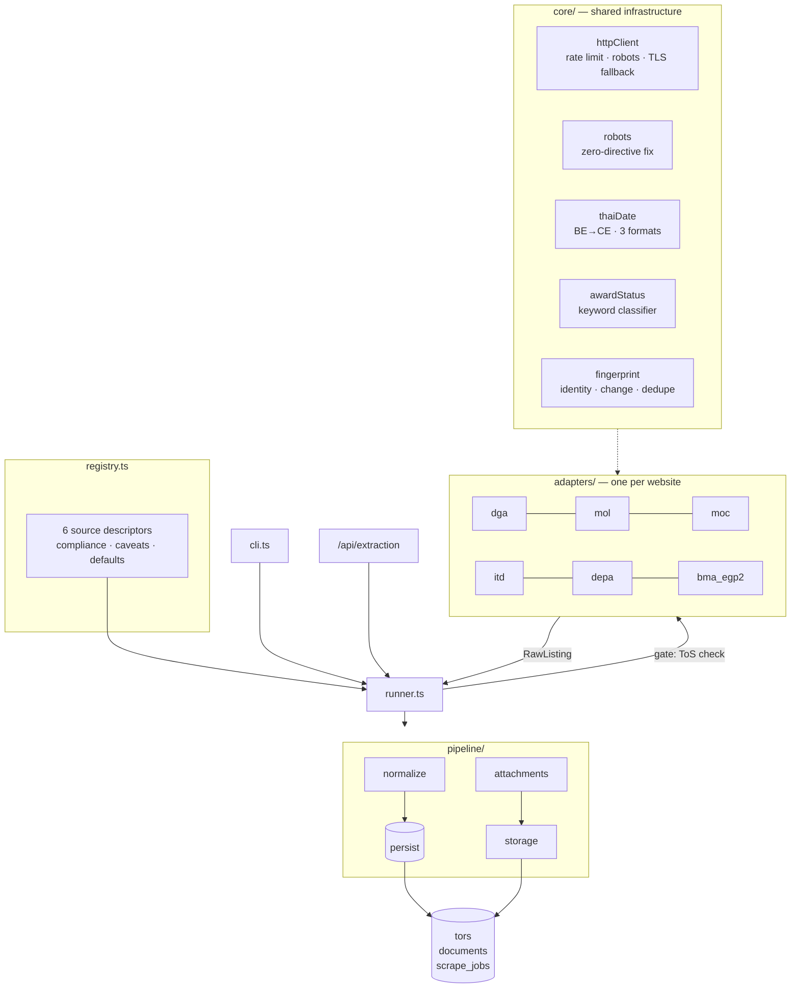

# Core Infrastructure & Extraction Pipeline

How pre-award Thai government procurement data gets from six public websites into `tors`, `documents`, and `scrape_jobs`.

**Sources:** 6 · **Runtime:** Node 18+ / TypeScript · **Location:** `back-end/src/extraction/` · **Companion doc:** [database-design.md](database-design.md)

This is a TypeScript port of the Python research scrapers documented in `PRE_AWARD_PLAYBOOK.md`. The port is deliberate about carrying over the playbook's hard-won behaviours rather than re-deriving them from each site's current markup — those behaviours are called out below wherever they shaped a design decision.

---

## 1 · What this pipeline is for

Awarded-contract data is easy to get: the national e-GP API publishes it, and every one of 26,814 BMA rows pulled from it had a signed contract. That data is useless to a vendor looking for work.

**Pre-award data — draft TOR, open bidding, live public-comment windows — is the entire point.** It exists only on individual agency websites, in inconsistent formats, and most of it is only actionable for a few days. Everything below follows from that.

---

## 2 · Architecture



### The seam

`RawListing` (in [`types.ts`](../back-end/src/extraction/types.ts)) is the only contract that matters.

- **Adapters know one website each.** They produce `RawListing` and never touch Mongoose.
- **Everything downstream knows nothing about websites.** The normalizer, dedupe, and persistence layers treat all six sources identically.

Adding a seventh source is one adapter file plus one registry entry. Nothing else changes.

---

## 3 · Module layout

| Path | Responsibility |
|---|---|
| `types.ts` | `RawListing`, `SourceAdapter`, `SourceDescriptor`, `RunResult` — the contracts |
| `registry.ts` | The six sources: compliance posture, caveats, defaults |
| `core/httpClient.ts` | Polite HTTP: honest UA, per-host rate limit, retries, charset decode, TLS fallback |
| `core/robots.ts` | robots.txt fetch/parse/cache, with the zero-directive fix |
| `core/thaiDate.ts` | Buddhist Era conversion, three date formats, comment windows, currency |
| `core/awardStatus.ts` | Thai keyword classifier — priority-ordered, ported verbatim |
| `core/fingerprint.ts` | Identity key, content hash, boilerplate stripping, republication grouping |
| `core/html.ts` | cheerio helpers, PDF link extraction, labelled-field reads |
| `core/logger.ts` | Scoped logger whose `collected` feeds `ScrapeJob.errors` |
| `core/config.ts` | Extraction settings, readable without a database connection |
| `adapters/*.adapter.ts` | One per website |
| `pipeline/runner.ts` | Orchestration, compliance gate, job lifecycle |
| `pipeline/normalize.ts` | `RawListing` → Tor upsert |
| `pipeline/attachments.ts` | Download PDFs, create Documents |
| `pipeline/storage.ts` | Content-addressed blob store (local now, GCS later) |
| `cli.ts` | `npm run extract` |

---

## 4 · Core infrastructure

### 4.1 The three-value award state

The single most important type decision in the pipeline:

```ts
isAwarded: boolean | null   // never a plain boolean
```

`null` means **the source did not say**, which is a different fact from "confirmed not awarded". About 65% of DEPA's 855 announcements use `วิธีเฉพาะเจาะจง` (direct appointment) — a procurement method that legally skips the public TOR and bidding stages, so the title never states one, and no status field exists on the listing or the detail page. Collapsing `null` into `false` would present 549 unclassifiable rows as actionable tenders.

This propagates all the way through: `Tor.lifecycle.isAwarded` defaults to `null`, and `--pre-award-only` filters on `isAwarded === false`, not on "not true".

### 4.2 Classification signal strength

Not all stage verdicts are worth the same, so every TOR records how its stage was determined:

| `signal` | Meaning | Sources |
|---|---|---|
| `authoritative` | The site's own status code | eGP BMA2 only |
| `doc_type` | A labelled document-type field | ITD, DGA |
| `title_keyword` | Keyword match on the title | everywhere else |

A consumer can then weight a `title_keyword` guess differently from a fact. This is playbook step 8 encoded as a stored field rather than left as tribal knowledge.

### 4.3 Classifier priority order is load-bearing

`core/awardStatus.ts` checks rules in a fixed order, and three of those orderings exist to fix specific observed collisions:

- `cancelled` first — `ยกเลิกประกาศประกวดราคา` would otherwise match `bidding_open`.
- `awarded` before anything mentioning `ประกวดราคา` — winner announcements name the bidding method in passing.
- `price_reference` **before** `bidding_open` — price-disclosure titles nearly always carry `ด้วยวิธีประกวดราคาอิเล็กทรอนิกส์` as a modifier. Found on ITD.

`awarded` also matches on the full phrase `สาระสำคัญในสัญญา`, never bare `สัญญา`, so `ร่างสัญญา` (draft contract) is not mistaken for an award.

> **Verified:** the ported rule table is identical to `award_status.py` stage-for-stage and keyword-for-keyword, and replaying the ported algorithm over all 991 real titles in the recorded scraper outputs reproduces the recorded `stage` column exactly — 0 mismatches, including ITD's doc-type-plus-title path.

### 4.4 Dates: three formats, one parser

Every source publishes in Buddhist Era, 543 years ahead of CE. Three formats appear:

| Format | Example | Sources |
|---|---|---|
| Thai month, 4-digit BE | `18 สิงหาคม 2569` | MOL, ITD, MOC |
| Thai abbreviated, 4-digit CE | `14 ส.ค. 2026` | DEPA |
| **English abbreviated, 2-digit BE** | `27 Jul 69` | **DGA — every row** |

The third is easy to miss and was: a Thai-only parser returns `null` for DGA's entire output, and a source with no parseable dates cannot be freshness-checked at all — the one check the playbook says to run every time. Two-digit years are read as short BE (`69` → 2569 → 2026), and every result is range-checked against a plausible window so an absurd date is rejected rather than stored.

> **Verified:** all 927 real date strings across the recorded outputs parse, with correct BE→CE conversion.

### 4.5 robots.txt, parsed here rather than borrowed

Python's `urllib.robotparser` returns `can_fetch() === false` for a robots.txt with zero `User-agent` groups — backwards, since a file with no rules restricts nothing. depa.or.th serves exactly that (a "content signals" style file with no traditional directives).

`core/robots.ts` implements the rules directly so that case is explicit:

- No reachable robots.txt → allowed
- Reachable, zero groups → **allowed** (the bug above)
- Groups present → longest-matching rule wins, `Allow` beats `Disallow` on a tie
- A group naming our UA beats the wildcard group
- `Crawl-delay` is honoured when longer than our own floor

> **Verified:** 11 cases pass, including the DEPA zero-directive file, BMA's `/upload/` disallow, `Allow`-beats-`Disallow`, and end-anchored wildcards.

### 4.6 Politeness, and why downloads are checked too

`core/httpClient.ts` enforces four things:

1. **Honest User-Agent** naming the project with a contact route. No browser impersonation.
2. **Per-host serialised requests** with a ≥1s gap, raised if robots.txt asks for more. Hosts are independent of one another.
3. **robots.txt checked on downloads, not just page fetches.** BMA's old CMS allows crawling its listing pages while disallowing the `/upload/` path its PDFs live under. A pipeline that checks only page fetches downloads files the site asked it not to — that was missed on a first pass in the research project and the PDFs had to be deleted afterwards.
4. **Broken TLS chains retry rather than crash.** Several `.go.th` hosts (confirmed: dft.go.th) serve incomplete certificate chains. Since this is public data behind no login, the fallback re-requests with verification disabled *for that one request* via `node:https` — never by setting `NODE_TLS_REJECT_UNAUTHORIZED` — and flags `insecure: true` so it lands on the job record instead of passing silently.

Responses are decoded using the charset the server declares; several Thai CMSes still serve `windows-874`/TIS-620, and reading those as UTF-8 turns every Thai keyword into replacement characters — breaking classification silently rather than throwing.

### 4.7 Identity, change, and duplicates

Three separate problems, three separate mechanisms in `core/fingerprint.ts`:

| Question | Mechanism |
|---|---|
| Is this the same announcement I already have? | `identityKey` — the site's own id when it has one, else (source, canonical URL, normalised title). Unique sparse index; the upsert key. |
| Has anything about it changed? | `contentHash` over the mutable fields, including attachment URLs. Unchanged → touch `lastSeenAt` only, skip the write. |
| Is this the same notice republished? | `groupRepublications` on (normalised title, date). MOC's CMS reposts one announcement per sub-department — a raw pull returned 37 rows that were 5 distinct announcements. |

Canonical URLs drop query strings, so a cache-busting `?ver=…&timestamp=…` doesn't fork the corpus.

**A source with no per-row URL needs a synthetic id.** MOL publishes a table with no detail pages, so identity would otherwise fall back to the *paginated* listing URL — and a single new announcement pushing rows onto the next page would make every shifted row look brand new. Replaying the recorded 48-row pull across two page sizes showed **13 of 48 rows changing identity**; MOL therefore emits an `externalId` of title + window start, which was stable across the same replay and still fully distinct.

**Boilerplate attachments** are stripped batch-wide: DGA links a site-wide policy PDF from every announcement's sidebar, and a link appearing on *every* row of a batch is furniture, not an attachment. This can only be judged with the whole run in hand, which is why it sits in the pipeline rather than in the adapter.

---

## 5 · The source registry and the compliance gate

`registry.ts` is the only file to touch when a source is added, retired, or re-assessed. It encodes the playbook's three checks, run in order, none substituting for another:

1. **Documented API?** The only category with real contractual footing.
2. **robots.txt.** Technical and machine-readable, but only ever a partial answer.
3. **Terms of Service.** The actual contract. Searched for explicitly, never inferred from robots.txt.

| Source | ToS status | Stage signal | Scheduled |
|---|---|---|---|
| DGA | 🟡 unverified | `title_keyword` | allowed |
| MOL | 🟡 unverified | `title_keyword` | allowed |
| MOC | 🟡 unverified | `title_keyword` | allowed |
| ITD | 🟡 unverified | `doc_type` | allowed |
| DEPA | 🟡 unverified | `title_keyword` | allowed |
| eGP BMA2 | 🔴 **prohibited** | `authoritative` | **blocked** |

🟡 **unverified** means no ToS page was found. That is *not* the same as cleared, and the registry says so in words rather than leaving it to be inferred from a green check.

### eGP BMA2 is blocked by default, in code

Clause (ฌ) of egp2.bangkok.go.th's Terms of Service bans "spider / crawl / scrape" by name, grouped with spam and phishing. Its `robots.txt` **allows** the exact paths the adapter uses. The two documents disagree, and the ToS governs use.

Technically it is the best source of the six — a real JSON API with a 13-code authoritative announce-type catalog, the only source that never guesses a stage. That makes an accidental run *more* likely, not less, which is why the gate is structural:

- `allowScheduled: false` excludes it from `runAllSchedulable()` entirely.
- `runSource()` refuses it unless `overrideTosBlock: { approvedBy, reason }` is supplied — **both** fields, no default, no env-var shortcut.
- The override is written to `ScrapeJob.complianceOverride`, so the decision is attributable after the fact.
- A refused run is recorded as `skipped`, never `failed`. They are different facts.
- The API returns `409` with the ToS text and the remedy, so an admin UI cannot render a bare "Run" button without surfacing why it is blocked.

No login, key, or CAPTCHA is bypassed anywhere in this pipeline, so no source raises a Computer Crime Act "unauthorised access" issue. The exposure is contractual: a breach gets an IP rate-limited or blocked and gives the site owner clean grounds to demand a stop. **Get the agency's sign-off before running this source at all.**

---

## 6 · A run, phase by phase

1. **Gate** — compliance checked before a single request goes out.
2. **Collect** — the adapter is consumed lazily; keyword and pre-award filters apply as rows arrive so the crawl stops as early as it can. A mid-crawl failure keeps the pages already collected and marks the run `partial`.
3. **Batch cleanup** — boilerplate attachment stripping and republication grouping, both of which need the whole batch.
4. **Persist** — upsert on `identityKey`; skip writes when `contentHash` is unchanged. One bad row is logged and skipped, never fatal.
5. **Report** — counts, stage tally, and the freshness check.

### The freshness check

A 200 OK with real-looking rows proves nothing — a source can serve a stale archive indefinitely. Every run compares the newest announcement date against today and warns when it exceeds 60 days, or when **no** dates parsed at all (which usually means a date format changed). Both land in `ScrapeJob.errors` and `newestAnnouncedAt`.

---

## 7 · Data model changes

Additions to the collections in [database-design.md](database-design.md):

**`tors`**
- `lifecycle` — `{ stage, stageLabel, isAwarded (nullable), signal }`. Distinct from `status`, which is *this platform's* review workflow: a TOR can be `published` here while its lifecycle stage is `bidding_open` at the agency.
- `sourceRef` — `{ sourceId, externalId, identityKey, contentHash, firstSeenAt, lastSeenAt }`
- `timeline.commentPeriodStart` — pairs with the existing `commentPeriodEnd`
- Indexes: unique sparse on `sourceRef.identityKey`; `lifecycle.stage + isAwarded`; comment-window range; `sourceId + lastSeenAt`

> Comment-window **status** is deliberately *not* stored. It changes every midnight and a stored copy goes stale between runs. Query it as `start <= now <= end`, which the compound index serves.

**`documents`**
- `origin` — `{ sourceUrl, label, storageKey, sha256, downloadedAt, insecureTransport }`
- Indexes on `origin.sha256` and `origin.storageKey`

**`scrape_jobs`**
- `sourceId`, `trigger`, `torsUpdated`, `torsUnchanged`, `attachmentsStored`, `stageCounts`, `preAwardCount`, `newestAnnouncedAt`, `complianceOverride`
- `status` gains `skipped`

Files are content-addressed at `{sourceId}/{sha256[0:2]}/{sha256}.pdf` and stored on disk behind a `BlobStore` interface. Swapping in GCS touches one file. Per the database design, PDFs must not live in MongoDB — the Flex-tier working set can't carry 8MB scanned announcements.

---

## 8 · Interfaces

### CLI

```bash
npm run extract -- --list
```

```bash
npm test
```

```bash
npm run extract -- --source dga --year 2569 --pages 2 --dry-run
```

```bash
npm run extract -- --source mol --pre-award-only --attachments
```

`--dry-run` parses and reports without connecting to or writing anything — the right way to check a selector after a site redesign. It needs no `MONGODB_URI` at all.

### HTTP

| Route | Purpose |
|---|---|
| `GET /api/extraction/sources` | The registry, compliance included |
| `POST /api/extraction/sources/:id/run` | Trigger a run |
| `GET /api/extraction/jobs` | Run history, filterable by source and status |
| `GET /api/extraction/jobs/:id` | One run in full |

`POST …/run` is **synchronous today**. A full DEPA pull with attachments takes minutes, so this is the first thing to move behind a queue when the admin UI lands.

---

## 9 · Scheduling

| Source | Suggested cadence | Why |
|---|---|---|
| **MOL** | **Daily** | Comment windows run 3–6 days. One pull found **1 open window in 48 rows** — anything less frequent misses live tenders entirely. |
| **MOC** | **Daily** | Also publishes comment windows (in title prose), so the same 3–6 day argument applies. |
| DGA | Daily | Paginates by fiscal year; small pages, cheap to re-walk. **Must run with `withDetail`** — dates live only on detail pages. |
| ITD | Daily | Small listing, labelled doc types. |
| DEPA | Weekly | The whole archive is one page load; new rows are infrequent. |
| eGP BMA2 | **Never scheduled** | ToS prohibits crawling. Manual, attributed runs only. |

`runAllSchedulable()` runs sources **sequentially**, not in parallel — each is rate-limited against its own host anyway, so parallelism buys little, and one at a time keeps the outbound pattern boring and keeps one source's failure out of another's job record.

---

## 10 · Failure handling

| Failure | Behaviour |
|---|---|
| Listing page 404 | End of pagination — stop cleanly, not an error |
| Detail page unreadable | Warn, keep the listing row (title + URL still have value) |
| Attachment blocked by robots.txt | Warn and skip. Not a bug — the site said no |
| Broken TLS chain | Retry once without verification, flag `insecure` |
| 5xx / connection reset | Retry with exponential backoff, capped |
| Crawl dies mid-run | Keep collected rows, mark the job `partial` |
| One row fails to persist | Warn and continue |
| Selector finds nothing | **Warn loudly** — a "successful" run that found nothing is the failure mode most likely to go unnoticed |
| ToS-prohibited source | Refuse before any request; record as `skipped` |

Warnings and errors accumulate on the logger and are written to `ScrapeJob.errors` (capped at 100), so there is one record of what a run saw rather than two that drift.

---

## 11 · Status and next steps

**Built and in this branch:** all six adapters, the core infrastructure, the compliance gate, normalization, dedupe, attachment storage, job records, CLI, HTTP routes, and a regression test suite.

**Verified by execution** — `tsc --noEmit` clean, `npm test` 31/31 passing, and a live dry run against all five schedulable sources:

| Source | Live result | Newest announcement |
|---|---|---|
| DGA | 24 rows — 4 draft_tor, 20 bidding_open | 2026-07-27 |
| MOL | 32 rows — all draft_tor | 2026-08-18 |
| MOC | 37 rows → **5 distinct** after republication grouping | 2026-08-19 |
| ITD | 24 rows — 13 draft_tor, 11 price_reference | 2026-06-26 |
| DEPA | 855 rows → 852; **other=549** | 2026-08-20 |
| eGP BMA2 | **`skipped`** — ToS gate refused it, no request sent | — |

DEPA's `other=549` matches the playbook's documented count of unclassifiable direct-appointment rows exactly, and MOC's 37→5 matches its documented republication figure.

Also replayed against the recorded Python corpus:

- Classifier rule table identical to the Python original; 991 real titles replayed with 0 mismatches
- 927 real date strings parsed correctly across all three formats
- 11 robots.txt cases including the documented zero-directive bug
- 980 real rows produce 980 distinct identity keys — no false collisions

### Bugs found and fixed during verification

Five, all silent rather than loud — which is the point of testing this layer hard:

1. **`robots.ts` had an unterminated character class** — would have thrown at module load.
2. **`runner.ts` flattened then spread two objects**, so the second `sourceRef` replaced the first — `sourceRef.firstSeenAt` and `source.discoveredAt` were never persisted.
3. **MOL identity derived from the paginated URL** — 13 of 48 rows changed identity on a page-size shift, creating duplicate TORs every run.
4. **Republication grouping merged ITD TORs with their price disclosures** — same title, same day, different URLs and stages. 6 distinct announcements lost per pull, and since the keeper is the first seen, the surviving row could be the `price_reference` while the `draft_tor` was discarded. Fixed by adding stage and document type to the grouping key; ITD's live yield went 19 → 24 rows and its `draft_tor` count 8 → 13.
5. **MOC read its date from the block text**, picking up the comment-window END date quoted in the title instead of the publish date — every row landed days in the future. Fixed by reading `.date` structurally; a future-dated newest announcement is now itself a warning.

Fix 5 also revealed that **MOC publishes a real public-comment window inside its title prose** (`ระหว่างวันที่ 19 - 24 ส.ค. 2569`). That is now parsed, making MOC the second source after MOL with an actionable window.

**Not yet built:**

- Live attachment downloads (`--attachments`) have not been exercised against any source
- No run has yet written to MongoDB — every live run so far was `--dry-run`
- Document AI OCR over stored PDFs, and Vertex AI enrichment of `tors.summaryAi` / `technologies` / `qualifications` — `normalize.ts` does only a deliberately crude keyword pre-tag so the corpus isn't completely untagged in the meantime
- A job queue behind the trigger route
- Auth on the extraction routes — they currently trigger outbound crawls with no authentication
- Scheduled execution (cron / Cloud Scheduler) wired to `runAllSchedulable()`

---

## 12 · Adding a seventh source

1. Investigate it in the playbook's order: documented API → robots.txt → Terms of Service. Check for an API *first*; two of nine sources in the research project turned out to have one.
2. Write `adapters/<id>.adapter.ts` producing `RawListing`.
3. Add a `registry.ts` entry with an honest `compliance` block and real `caveats`.
4. Add the id to the `SourceId` union and to the enums in `Tor.sourceRef.sourceId` and `ScrapeJob.sourceId`.
5. Run `--dry-run` and check the stage distribution and the newest date before letting it write anything.

Nothing in `pipeline/`, `normalize.ts`, or the models needs to change.

---

*Ported from the Python research scrapers documented in `PRE_AWARD_PLAYBOOK.md`. Re-verify recency and ToS status before scaling any source up — both change without notice.*
